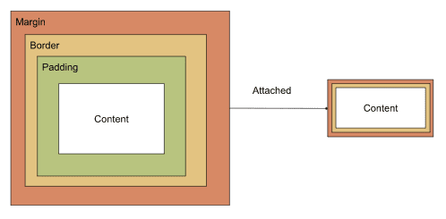
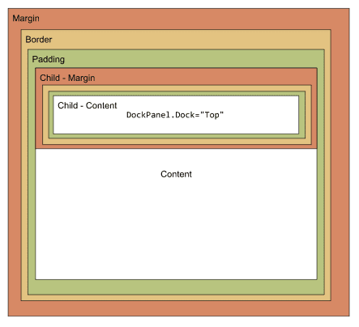

# Attached Properties

_Avalonia UI_ controls support the **attached property** concept. This is a property applied to a child control that references its container control.

In XAML, attached properties are defined as attributes of the child control element using the format: `ContainerClassName.AttachedPropertyName="value"`

Here are some scenarios where an attached property is used:

## Attached Control

An additional control is attached to a 'host control' for some purpose. This can be used where the control usually only allows a single child in its content zone. In this scenario the attached control is not counted as part of the content, but it will be used in some other way by the container. Examples include: context menus, tool tips and flyouts. 

## Layout Control

Attached layout properties are used in scenarios where the container control has to know something about the child controls it is going to arrange. Examples include: grids, dock panels and relative panels.

> [!NOTE]
> For a full list of the _Avalonia UI_ built-in controls, see the reference [here](../reference/controls/index.md).

