# Bitmap Blend Modes

When rendering bitmaps graphics on screen, Avalonia supports specifying what blend mode to use while rendering. Blend modes changes the calculations performed when drawing new pixels (source) over existing pixels (destination).

Currently Avalonia Composite modes and Pixel Blend modes are located in a single enum called `BitmapBlendingMode`.

Composite modes enums mainly describes how the new pixels interact with the current on-screen pixels according to the alpha channel, this can be used to create, for example: "cookie cutters", exclusion zones or masks.

Pixel Blend modes on the other hand, specifies how the new colors will interact with the current colors. These modes can be used for example: on special effects, change color hues or other more complex image compositions.

See the [Wikipedia page](https://en.wikipedia.org/wiki/Blend_modes) on blend modes for examples of how they work and the math behind them.

> [!NOTE]
> Currently Avalonia only supports Blend Modes when using the Skia renderer. Trying to use these modes with the D2D renderer will result in the same behavior as the default mode.

## Default Behavior

The default blend mode is `SourceOver`, meaning replacing all pixels values by the new values, dictated by the alpha channel. This is the standard way most applications overlay two images.

## How to use it

In XAML, you can specify what blend mode to use when rendering a Image control. The following example will render a color overlay over the picture of a very cute cat:

```xml
<Panel>
    <Image Source="./Cat.jpg"/>
    <Image Source="./Overlay-Color.png" BlendMode="Multiply"/>
</Panel>
```

If you're creating a Custom User control and want to render a bitmap with code using one of these modes, you can do so by setting the `BitmapBlendingMode` in the control context render options:

``` csharp
// Inside the "Render" method, draw the bitmap like this:

using (context.PushRenderOptions(RenderOptions with { BitmapBlendingMode = BitmapBlendingMode.Multiply }))
{
    context.DrawImage(source, sourceRect, destRect);
}
```

## Bitmap Blend Mode Gallery

Avalonia supports several bitmap blend modes that can be applied to rendering:

### Pixel Blend Modes

Pixel blend modes affect only the color without taking into consideration the alpha channel.

These are the images used in the examples:

| Cute Cat base image (destination) | Color Wheel overlay image (source) |
|:---:|:---:|
|  | 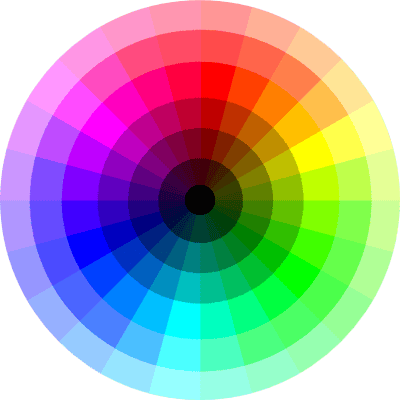 |

Below are all the values currently supported by Avalonia

| Preview | Enum | Description |
|---|---|---|
| 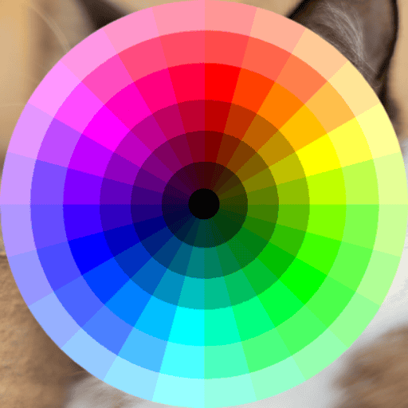 | `Unspecified` | or `SourceOver` - Default Behavior. |
| 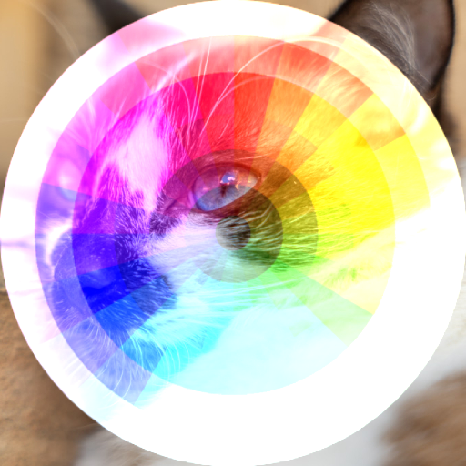 | `Plus` | Display the sum of the source image and destination image. |
| 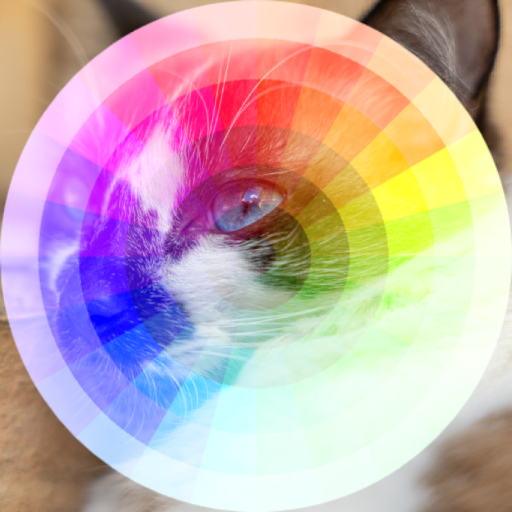 | `Screen` | Multiplies the complements of the destination and source color values, then complements the result. |
| 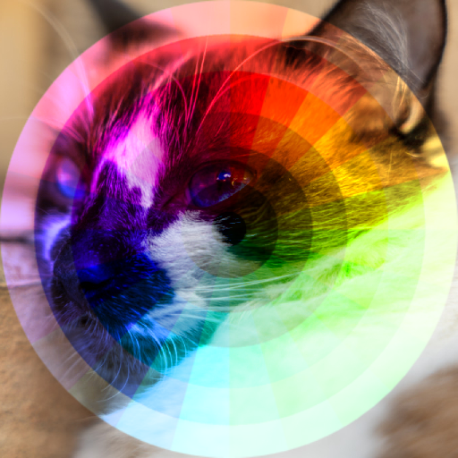 | `Overlay` | Multiplies or screens the colors, depending on the destination color value. |
| 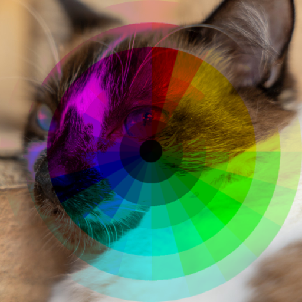 | `Darken` | Selects the darker of the destination and source colors. |
| 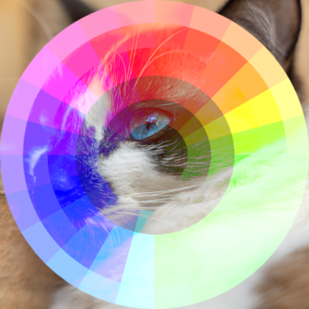 | `Lighten` | Selects the lighter of the destination and source colors. |
| 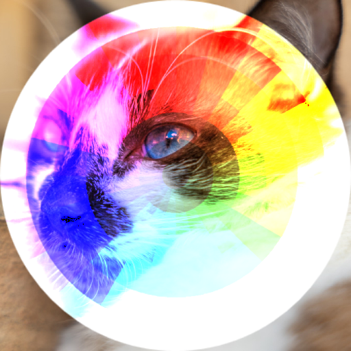 | `ColorDodge` | Darkens the destination color to reflect the source color. |
| 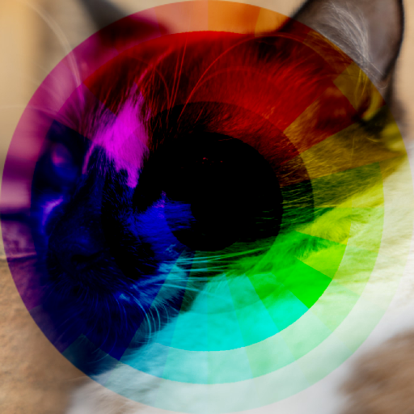 | `ColorBurn` | Multiplies or screens the colors, depending on the source color value. |
| 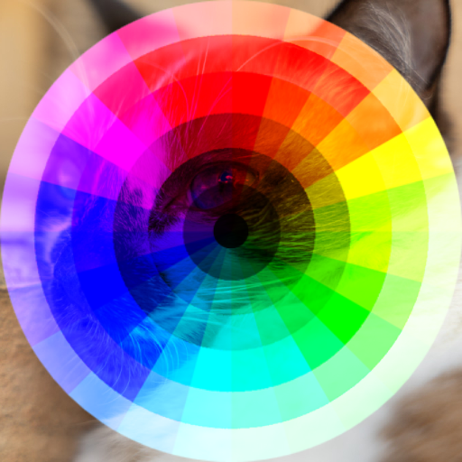 | `HardLight` | Darkens or lightens the colors, depending on the source color value. |
| 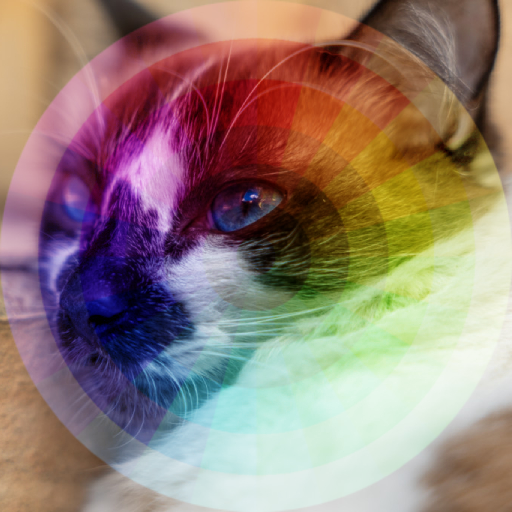 | `SoftLight` | Subtracts the darker of the two constituent colors from the lighter color. |
| 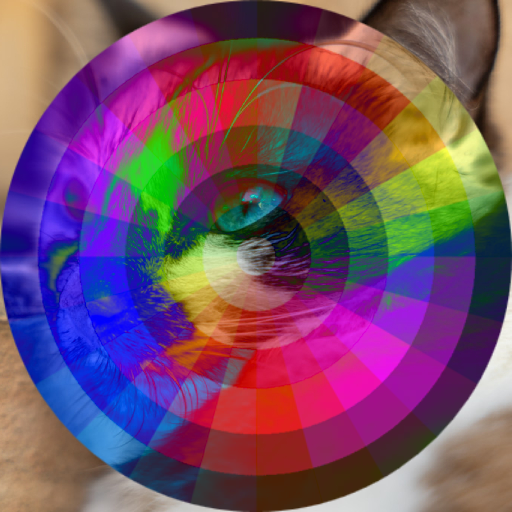 | `Difference` | Produces an effect similar to that of the Difference mode but lower in contrast. |
| 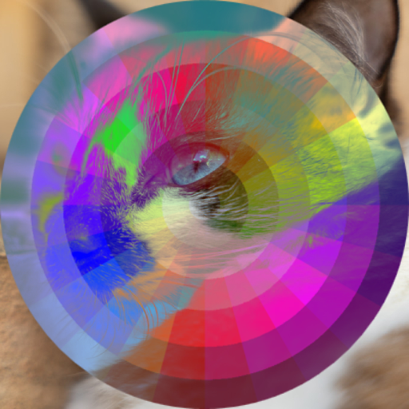 | `Exclusion` | The source color is multiplied by the destination color and replaces the destination|
| 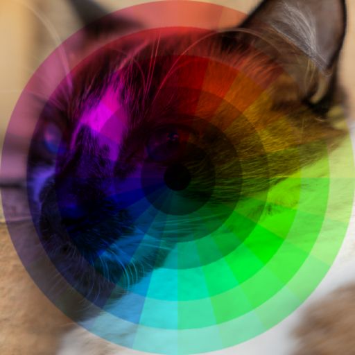 | `Multiply` | Creates a color with the hue of the source color and the saturation and luminosity of the destination color. |
| 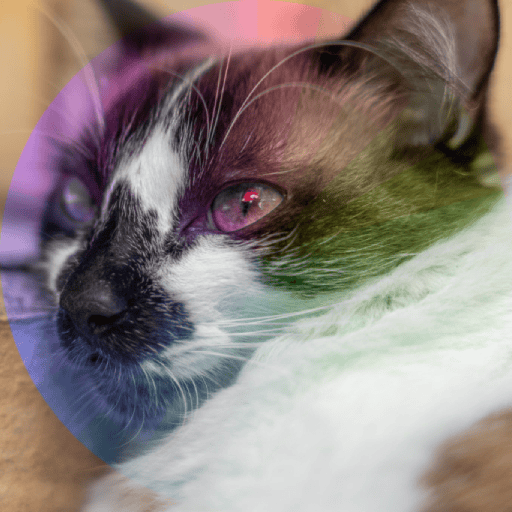 | `Hue` | Creates a color with the hue of the source color and the saturation and luminosity of the destination color. |
| 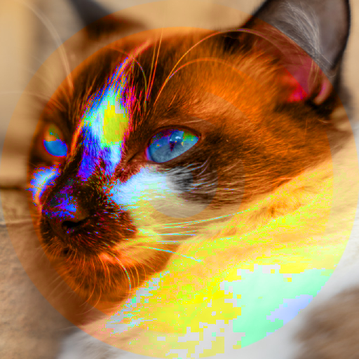 | `Saturation` | Creates a color with the saturation of the source color and the hue and luminosity of the destination color. |
| 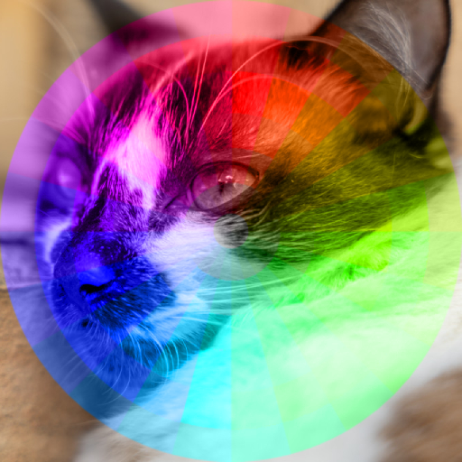 | `Color` | Creates a color with the hue and saturation of the source color and the luminosity of the destination color. |
| 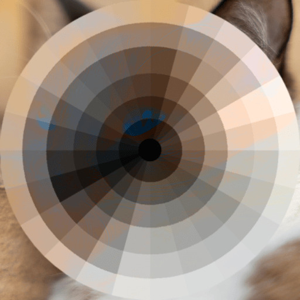 | `Luminosity` | Creates a color with the luminosity of the source color and the hue and saturation of the destination color. |

### Composition Blend modes

Composition blend modes affect only the alpha channel without messing with the colors.

These are the images used in the examples:

| "A" base image (destination) | "B" overlay image (source) |
|:---:|:---:|
|  |  |

Below are all the values currently supported by Avalonia. Please note that this demo is sensitive to the alpha channel and therefore the website background bleed through the images.

| Preview | Enum | Description |
|---|---|---|
|  | `Source` | Only the source will be present. |
|  | `SourceOver` | or `Unspecified` - Default behavior, Source is placed over the destination. |
|  | `SourceIn` | The source that overlaps the destination, replaces the destination. |
|  | `SourceOut` | Source is placed, where it falls outside of the destination. |
|  | `SourceAtop` | Source which overlaps the destination, replaces the destination. |
|  | `Xor` | The non-overlapping regions of source and destination are combined. |
|  | `Destination` | Only the destination will be present. |
|  | `DestinationOver` | Destination is placed over the source. |
|  | `DestinationIn` | Destination which overlaps the source, replaces the source. |
|  | `DestinationOut` | Destination is placed, where it falls outside of the source. |
|  | `DestinationAtop` | Destination which overlaps the source replaces the source. |

