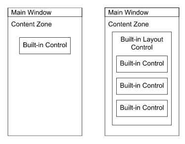
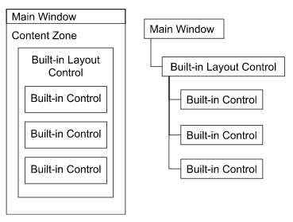
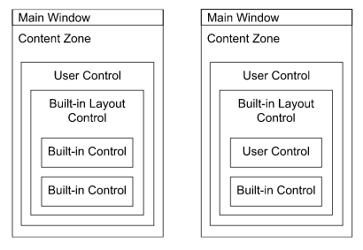
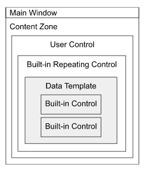

# UI Composition

UI composition is the process you use to create the layouts that your apps require. It allows you to build a complex view from an arrangement of components. The advantages are:

* _Encapsulation_ - reduce the complexity of each component by restricting its XAML and code to only what it needs, making your code more understandable and maintainable.
* _Reuse_ - maintain consistent presentation and behaviour of repeated parts of your app.

_Avalonia UI_ makes it easy for you to use UI composition to create the layouts and functions that your apps require.

When you build an app using _Avalonia UI_, there are several different types of component to choose from:

* Windows
* Built-in Controls
* User Controls
* Custom Controls
* Template Controls

## Windows and Built-in Controls

A window in _Avalonia UI_ is a basic unit of layout (for a windowing platform).

_Avalonia UI_ contains a large number of built-in controls that will cover most of your UI requirements.   

When you first meet _Avalonia UI_, you might place a single built-in control in the content zone of a window (above, left). This is the simplest form of UI composition: the window has the title of the app and usually some window state controls (depending on the target platform). The built-in control allows your app to receive some user input, or to present some output with layout and styling.

A slightly more complex app may require one of the built-in layout controls to arrange more than one other built-in control in the content zone of a window (above, right).

> [!NOTE]
> To see the full range of Avalonia UI built-in controls, see the reference section [here](../reference/controls/index.md).

## Logical and Visual Trees

Whatever arrangement of controls you use, _Avalonia UI_ represents their relationships as a a tree structure, with the 'outermost' control as the root. So for example, the previous UI composition can be represented as the tree shown here:

This is the **logical control tree**, and it represents the application controls (including the main window) in the hierarchy in which they are defined in the XAML. There are many systems in _Avalonia UI_ that process the logical control tree and its companion the **visual control tree**.

> [!NOTE]
> For more information on the concept of control trees, see [here](control-trees.md).

## User Controls

User controls are the mainstay of UI composition in _Avalonia UI_.

You can add a user control to the content zone of a main window, to represent a 'page view' (above, left).  This allows you to implement a more complex app with multiple pages; where the layout and function of each page is in its own user control (XAML and code) files.   

> [!NOTE]
> For more information about how to implement a multi-page app using views, see the guide [here](../guides/development-guides/how-to-implement-multi-page-apps.md).

Another use for a user control is as a component control (above, right). You might initially do this to reduce the complexity of a window or page view; but then you might also (perhaps later) reuse the resulting component on another page as well.

## Tutorial

> [!NOTE]
> For tutorials about `DataTemplates` see [Avalonia.Samples](https://github.com/AvaloniaUI/Avalonia.Samples/tree/main?tab=readme-ov-file#%EF%B8%8F-datatemplate-samples).  

## Collection Controls

Another variation of UI composition is where you need to present a collection of items.

This scenario will use one of the built-in repeating controls, bound to a collection; together with a data template to represent the items in the collection.

> [!NOTE]
> For information about how to  TO DO

## Custom Controls

In the unlikely scenario that you cannot find an _Avalonia UI_ built-in control to cover your app's UI requirements, then you can 'roll-your-own' custom control from scratch. This allows you to define your own custom properties, events and methods; but it will require you to implement the drawing of the control presentation from scratch as well.

> [!NOTE]
> To learn how to implement a custom control, see the guide [here](../basics/user-interface/controls/creating-controls/index.md).

## Templated Controls

A templated control uses the _Avalonia UI_ **styling** system to substitute a tag in the UI layout with a

> [!NOTE]
> For more information about the concepts behind the _Avalonia UI_ **styling** system, see [here](../basics/user-interface/styling/index.md).

