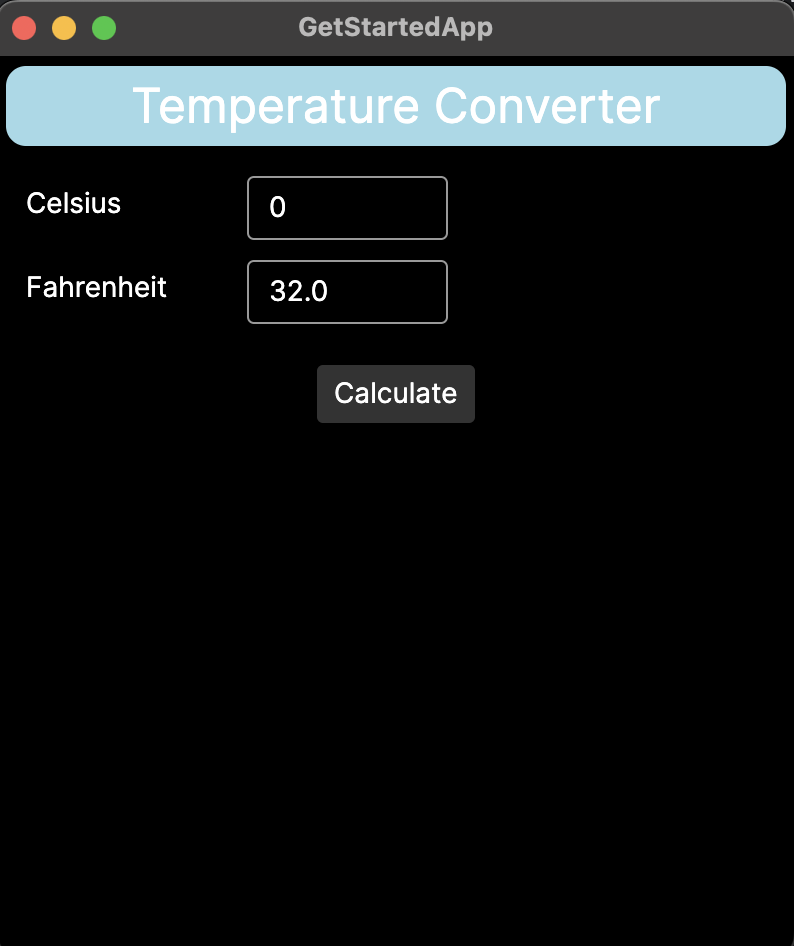
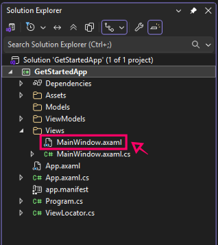

# Starter tutorial

## Build a temperature converter app

Now that you’re set up with an Avalonia project in your integrated development environment (IDE), as covered on the [Getting Started page](../index.md#creating-your-first-project), we can go through some basic concepts and functionalities in Avalonia. We’re going to do that by turning the default Avalonia template into a temperature converter app.

Follow through this tutorial to create the app. As you do so, you will learn about:

- [Adding a control](adding-a-control.md)
- [Adding some layout](adding-some-layout.md)
- [Customizing the Avalonia window](customizing-the-avalonia-window.md)
- [Establishing events and responses](establishing-events-and-responses.md)
- [Converting data](converting-data.md)
- [Exercises](exercises.md)

## .axaml

Notice the files in your project directory ending `.axaml`? That’s short for Avalonia XAML, a file extension unique to Avalonia that differentiates Avalonia files from standard XAML files.

## Check your XAML previewer works

If you have newly installed Avalonia in Visual Studio or JetBrains Rider, and you are new to IDE development in general, this may be a good time to check you can use the XAML previewer.

See the [XAML previewers page](../xaml-previewers.md) for how to enable and test the previewer.

## Open the main window file

In the **Views** folder of your project directory, open the file **MainWindow.axaml**. We will mainly be working on this file throughout this tutorial.

Nearly everything in **MainWindow.axaml** goes between the `<Window>...</Window>` XAML tag. This tag represents the Avalonia window, where your app will run on the target platform. We’ll look at Avalonia windows in more detail later, when we get to [customizing the Avalonia window](customizing-the-avalonia-window.md).

Proceed to the next page of this tutorial to learn how to add a button to the app.

