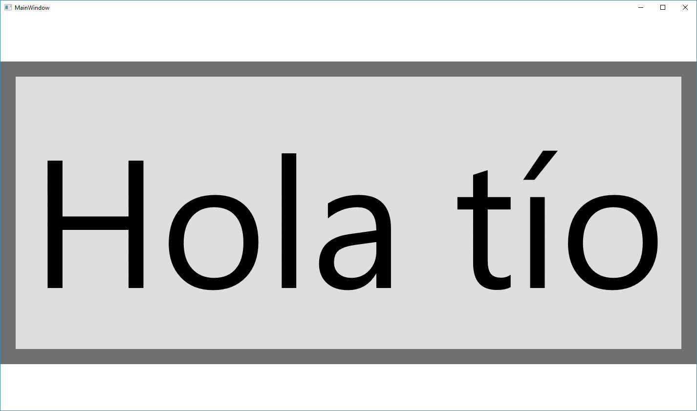
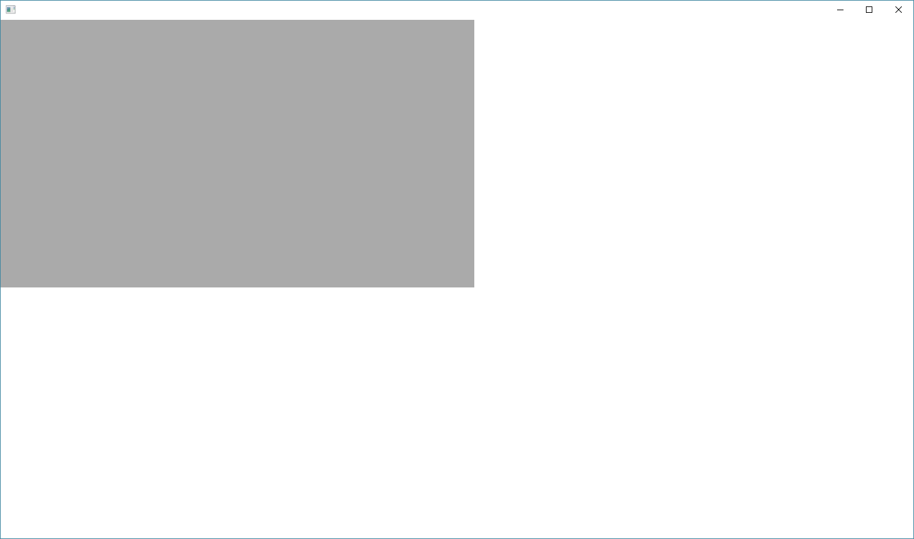

# RenderTransforms and RenderTransformOrigin

RenderTransformOrigins are different in WPF and Avalonia: If you apply a `RenderTransform`, keep in mind that default value for the RenderTransformOrigin in Avalonia is `RelativePoint.Center`. In WPF the default value is `RelativePoint.TopLeft` \(0, 0\). In controls like Viewbox the same code will lead to a different rendering behavior:

**In WPF:**

**In Avalonia:**

In AvaloniaUI, to get the same scale transform we should indicate that the RenderTransformOrigin is the TopLeft part of the Visual.

> [!TIP]
> Also see the [Avalonia XPF docs](../../../xpf/welcome.md) for WPF migration and XPF-specific guidance.

