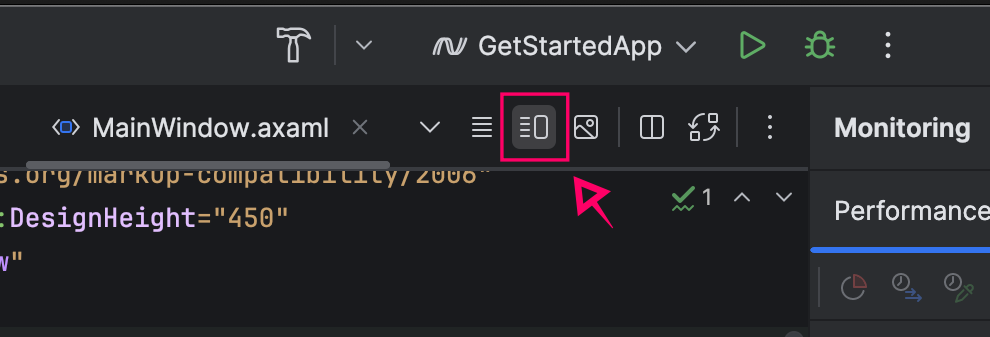
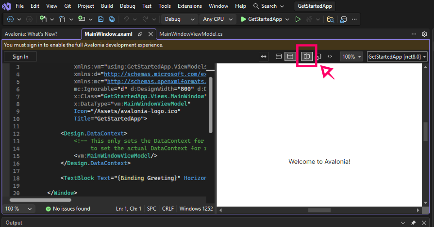
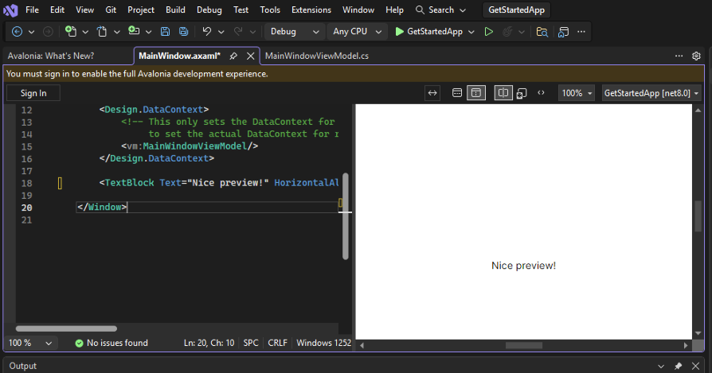

# XAML previewers

XAML previewers are available in JetBrains Rider with the third-party AvaloniaRider plugin, as well as Visual Studio with the Avalonia for Visual Studio plugin. With a XAML previewer, you can view changes to your XAML code live as you work. We strongly recommend using one for the best development experience.

## Enabling the XAML previewer

If you are new to developing with IDEs, here's how to enable the XAML previewer in Rider and Visual Studio.

### Rider

	  1. In Rider, select a **.axaml** file from the top ribbon.
    2. On the right side of the top ribbon, click **Editor and Preview**.
    3. Build your project.

    

### Visual Studio

    In Visual Studio, the XAML previewer is usually open by default. If it isn’t, follow these steps to enable it.

    1. In Visual Studio, open a **.axaml** file.
    2. Click **Split View** at the top of the editor window.
    3. Build your project.

    

## Checking it works

1. Open any **.axaml** file. For this example, we’re going to use **MainWindow.axaml** from the default Avalonia template.
2. Locate the `<TextBlock>...</TextBlock>` XAML tag near the bottom.
3. Remove `{Binding Greeting}`. Change it to any text, e.g., "Nice preview!"
4. You should see your text appear in the preview pane as you type.

> [!TIP]
> If the previewer is unresponsive to your changes, try building the project again.

