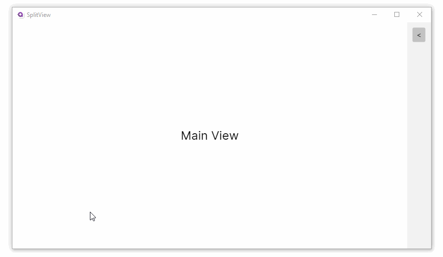

# How To Show and Hide a Split View Pane with MVVM

Content in preparation.

You can use the MVVM pattern with the split view control to implement a 'tool pane' style UI.

> [!NOTE]
> This technique uses a complex **binding path** to locate the parent view model for the

TO DO

