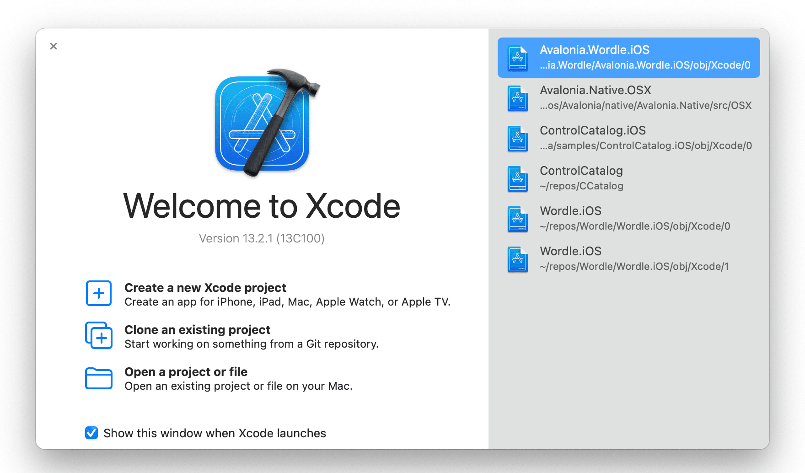
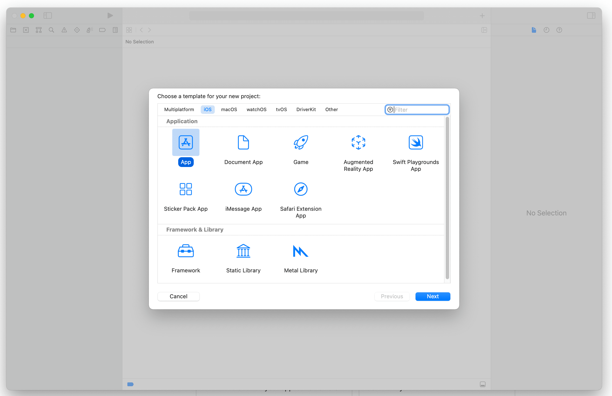
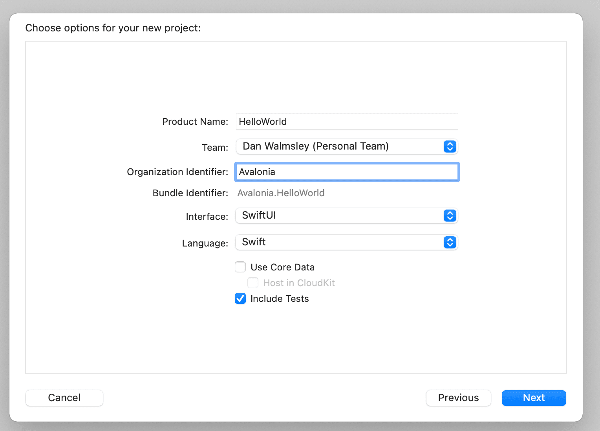
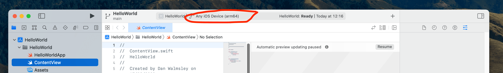
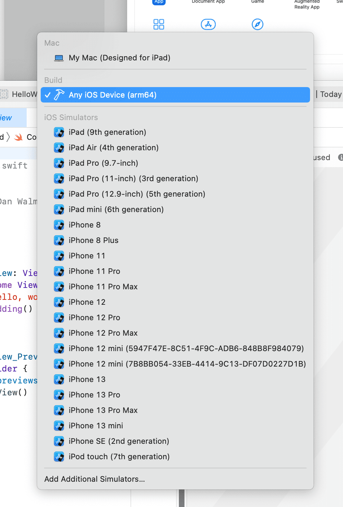
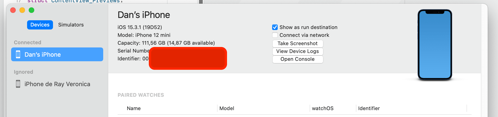
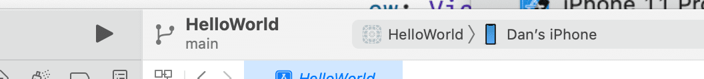
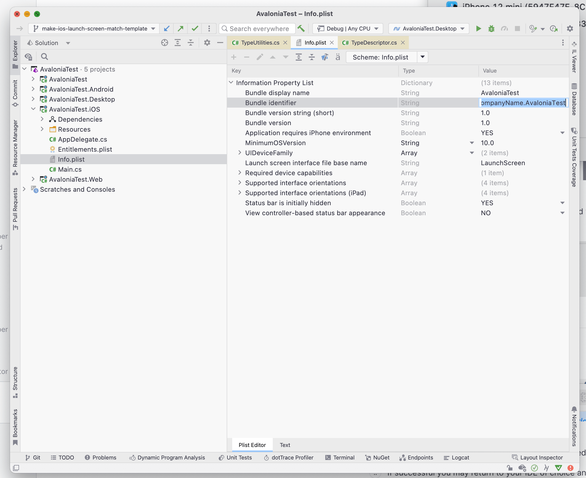
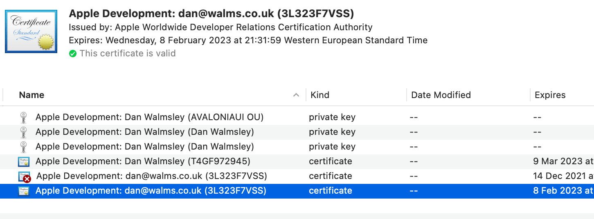

# How to Build and Run on iPhone or iPad

In order to allow dotnet to sideload your application to your iphone or ipad you must first use Xcode to provision your device.

Before continuing follow this [guide to create a free Apple developer signing certificate](https://docs.microsoft.com/en-us/xamarin/ios/get-started/installation/device-provisioning/free-provisioning).

This has to be done by creating an Xcode app project that has the same `bundle identifier` that you will use in your application.

1. Open Xcode



2. Select Create a new Xcode project



3. Select iOS and App and click Next.



4. Type in a name for your project and Organisation. Keep all the rest of the information the same.

5. Choose a directory to save the project. You will not need to keep the project so don't worry too much about where.

6. In the status bar at the top click on the "Any device (arm64)"



7. At the bottom of the list click "Add Additional Simulators..."



8. Click on devices and connect your iPhone or iPad with the USB cable. Xcode will start to provision your phone for development.



9. Select you iPhone or iPad from the device list.



10. Click the play button and the app will be installed and run on your phone.

If successful you may return to your IDE of choice and open the `info.plist` file from the iOS project.

11. Change the bundle identifier to the same as the one you choose in Xcode in step 3.



12. Now edit the `.iOS.csproj` file.

```xml
<RuntimeIdentifier>ios-arm64</RuntimeIdentifier>
<CodesignKey>Apple Development: dan@walms.co.uk (3L323F7VSS)</CodesignKey>
```

Change the `RuntimeIdentifier` from `iossimulator-x64` to `ios-arm64`

> [!NOTE]
> `You will need to reverse this step if you wish to run in the simulator in future.`

Add a `<CodesignKey>` tag.

To find the value for this open the application `KeyChain Access`. In the search box search for development.



Set the value exactly as the bold text at the top of the window on your selected development certificate.

`Apple Development: dan@walms.co.uk (3L323F7VSS)` in this case.

After this you can run and debug your application on the iPhone or iPad like any normal

