# Animation Settings

This section describes how `Animation` playback can be customized.

## Easing Functions

`Easing` functions describe how quickly an animated property changes from its starting value into its ending value across the animation time. `Avalonia.Animation.Easings` contains the following easings:

| Default                                                       |
|---------------------------------------------------------------|
| `LinearEasing` 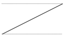 |

| Ease-In                                                                 | Ease-Out                                                                  | Ease-In-Out                                                                   |
|-------------------------------------------------------------------------|---------------------------------------------------------------------------|-------------------------------------------------------------------------------|
| `SineEaseIn` 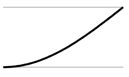               | `SineEaseOut` 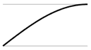               | `SineEaseInOut` 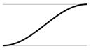               |
| `QuadraticEaseIn` 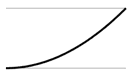     | `QuadraticEaseOut` 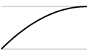     | `QuadraticEaseInOut` 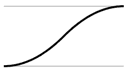     |
| `CubicEaseIn` 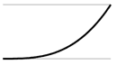             | `CubicEaseOut` 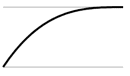             | `CubicEaseInOut` 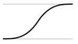             |
| `QuarticEaseIn` 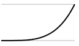         | `QuarticEaseOut` 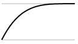         | `QuarticEaseInOut` 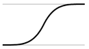         |
| `QuinticEaseIn` 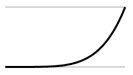         | `QuinticEaseOut` 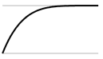         | `QuinticEaseInOut` 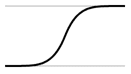         |
| `ExponentialEaseIn` 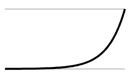 | `ExponentialEaseOut` 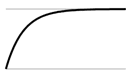 | `ExponentialEaseInOut` 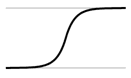 |
| `CircularEaseIn` 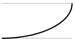       | `CircularEaseOut` 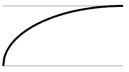       | `CircularEaseInOut` 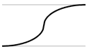       |
| `BackEaseIn` 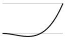               | `BackEaseOut` 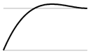               | `BackEaseInOut` 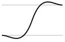             |
| `ElasticEaseIn` 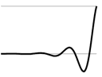         | `ElasticEaseOut` 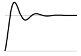         | `ElasticEaseInOut` 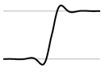         |
| `BounceEaseIn` 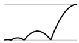           | `BounceEaseOut` 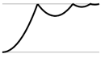           | `BounceEaseInOut` 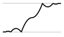           |

Additionally, you can provide your own easing by deriving from `Easing` or by providing parameters to `SplineEasing` or `SpringEasing`.

## FillModes

The `FillMode` attribute of an `Animation` defines how the animated property persists after an animation completes and during delays in-between runs.

The following table describes the supported behaviors:

| Value      | Description                                                                                               |
|------------|-----------------------------------------------------------------------------------------------------------|
| `None`     | Value will not persist after animation nor the first value will be applied when the animation is delayed. |
| `Forward`  | The last interpolated value will be persisted to the target property.                                     |
| `Backward` | The first interpolated value will be displayed on animation delay.                                        |
| `Both`     | Both `Forward` and `Backward` behaviors will be applied.                                                  |

## PlaybackDirection

`PlaybackDirection` defines how the `Animation` will be played. The following table describes the possible settings:

| Value              | Description                                             |
|--------------------|---------------------------------------------------------|
| `Normal`           | The animation is played normally.                       |
| `Reverse`          | The animation is played in reverse direction.           |
| `Alternate`        | The animation is played forwards first, then backwards. |
| `AlternateReverse` | The animation is played backwards first, then forwards. |

## IterationCount

The `IterationCount` on an `Animation` element sets how many times it is to be replayed. There are two formats for this setting:

| Value      | Description                                      |
|------------|--------------------------------------------------|
| `N`        | (N is an integer) - play N times. N can be zero. |
| `Infinite` | Repeats forever                                  |

