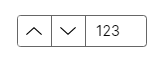

# Button Spinner

The `ButtonSpinner` presents a control that includes buttons for spin-up and spin-down. The content of this button is flexible, but you will have to code quite a lot of the behavior.

## Useful Properties

You will probably use these properties most often:

<table><thead><tr><th width="261">Property</th><th>Description</th></tr></thead><tbody><tr><td><code>ButtonSpinnerLocation</code></td><td>Location of the spinner buttons: left or right.</td></tr><tr><td><code>ValidSpinDirection</code></td><td>Used to limit spin direction: increase, decrease or none. </td></tr></tbody></table>

## Example

```xml
<ButtonSpinner Height="20" Width="130" ButtonSpinnerLocation="Left">
  123
</ButtonSpinner>
```



## More Information

> [!NOTE]
> For the complete API documentation about this control, see [here](https://api-docs.avaloniaui.net/docs/T_Avalonia_Controls_ButtonSpinner).

> [!NOTE]
> View the source code on _GitHub_ [`ButtonSpinner.cs`](https://github.com/AvaloniaUI/Avalonia/blob/master/src/Avalonia.Controls/ButtonSpinner.cs)

