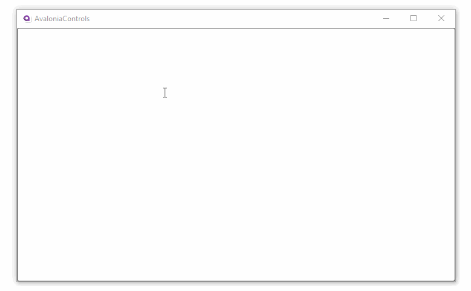

# ContextMenu

The `ContextMenu` can be applied to any host control to implement a right-click 'context sensitive' menu. This uses an **attached property** of the host control.

> [!NOTE]
> To review the concept behind this use of  an **attached property**, see [here](../../concepts/attached-property.md).

## Example

This example, a context menu is attached to a multi-line text box:

```xml
<TextBox AcceptsReturn="True" TextWrapping="Wrap">
  <TextBox.ContextMenu>
    <ContextMenu>
      <MenuItem Header="Copy"/>
      <MenuItem Header="Paste"/>
    </ContextMenu>
  </TextBox.ContextMenu>     
</TextBox>
```



## Context Flyout

You can use a context flyout as an alternative to a context menu. A context flyout can provide a sharable and richer UI experience than a simple context menu.

> [!WARNING]
> A control cannot have a context flyout and a context menu attached at the same time.

A context flyout is invoked automatically like a context menu.

## More Information

> [!NOTE]
> For the complete API documentation about this control, see [here](https://api-docs.avaloniaui.net/docs/T_Avalonia_Controls_ContextMenu).

> [!NOTE]
> View the source code on _GitHub_ [`ContextMenu.cs`](https://github.com/AvaloniaUI/Avalonia/blob/master/src/Avalonia.Controls/ContextMenu.cs)

