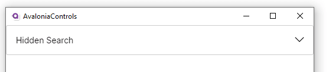
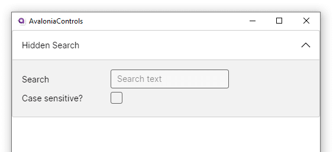

# Expander

The expander control has a header area (always visible) and a collapsible content section that can contain a single child control.

## Useful Properties

You will probably use these properties most often:

<table><thead><tr><th width="266">Property</th><th>Description</th></tr></thead><tbody><tr><td>Expander.Header</td><td>Defines what appears in the header area. </td></tr></tbody></table>

## Example

```xml
<Expander VerticalAlignment="Top">
    <Expander.Header>
        Hidden Search
    </Expander.Header>
    <Grid RowDefinitions="*,*" ColumnDefinitions="150,*">
        <TextBlock Grid.Row="0" Grid.Column="0"
                   VerticalAlignment="Center">Search</TextBlock>
        <TextBox Grid.Row="0" Grid.Column="1"
                 Watermark="Search text" Width="200" />
        <TextBlock Grid.Row="1" Grid.Column="0"
                   VerticalAlignment="Center">Case sensitive?</TextBlock>
        <CheckBox Grid.Row="1" Grid.Column="1" />
    </Grid>
</Expander>
```





## More Information

> [!NOTE]
> For the complete API documentation about this control, see [here](https://api-docs.avaloniaui.net/docs/T_Avalonia_Controls_Expander).

> [!NOTE]
> View the source code on _GitHub_ [`Expander.cs`](https://github.com/AvaloniaUI/Avalonia/blob/master/src/Avalonia.Controls/Expander.cs)

